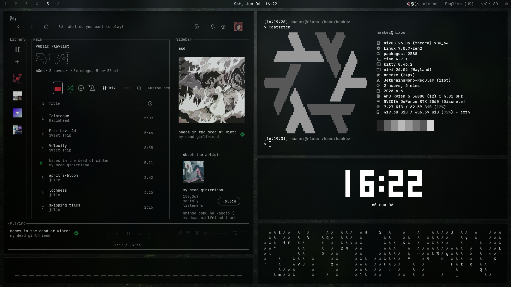

# хейкез's nixos config



## system components

* **os:** nixos
* **sompositor:** niri 
* **shell:** fish
* **terminal:** kitty
* **bar:** waybar
* **browser:** firefox
* **launcher:** fuzzel
* **notifications:** fnott

## usage

to install, run:

```bash
git clone https://github.com/haaakez/nixos-configuration
cd ~/nixos-configuration
sudo nixos-rebuild switch --flake .#nixos

```
## tree
```
nixos-configuration/
├── flake.nix                 
├── home.nix                  
├── hosts/
│   └── nixos/
│       ├── configuration.nix 
│       └── hardware-configuration.nix
└── dotfiles/                 
    ├── niri/
    ├── waybar/
    ├── kitty/
    └── ...
```
