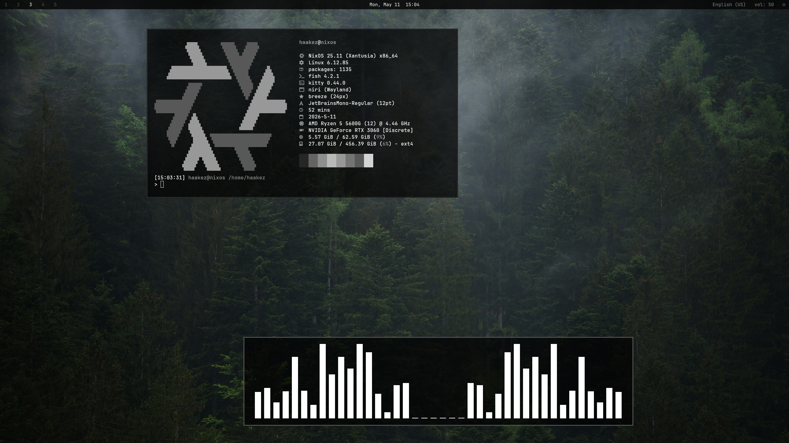

# хейкез's NixOS Configuration



## System Components

* **OS:** NixOS (Unstable)
* **Compositor:** Niri 
* **Shell:** Fish
* **Terminal:** Kitty
* **Bar:** Waybar
* **Browser:** Firefox (Textfox)
* **Launcher:** Fuzzel
* **Notifications:** Mako

## Usage

To rebuild, run:

```bash
sudo nixos-rebuild switch --flake .#nixos

```
##Tree
```
nixos-configuration/
├── flake.nix                 
├── home.nix                  
├── hosts/
│   └── nixos/
│       ├── configuration.nix 
│       └── hardware-configuration.nix
└── dotfiles/                 
    ├── niri/
    ├── waybar/
    ├── kitty/
    └── ...
```
